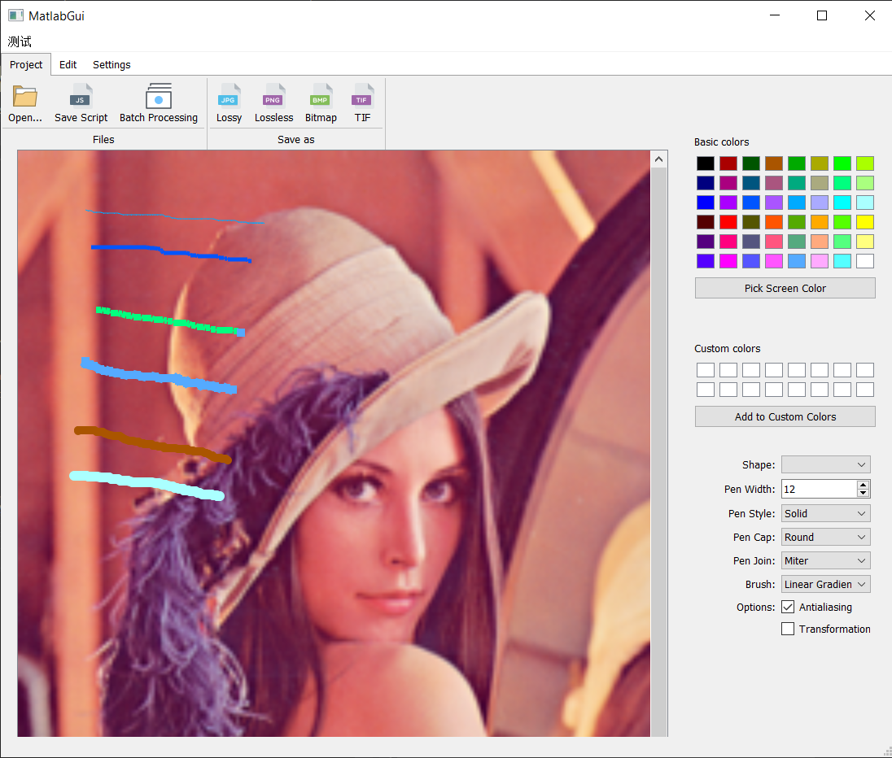

# Photolab

| name   | id         | personal document          |
| ------ | ---------- | -------------------------- |
| 毛文涵 |            |                            |
| 康嘉成 |            |                            |
| 林昭炜 | 3170105728 | [personal report](leon.md) |

[TOC]

## 问题及背景

图像处理通常科研人员使用的是Matlab，而艺术家使用的是Photoshop，但是科研人员新发明的滤波能力或者处理图片的算法往往不能很快地嵌入ps。我们希望由一种工具，能同时对开发人员和图像处理人员友好，于是我们想到了能否把二者整合起来

我们选用的是拥有类似于Photoshop的功能的图形界面，也提供给开发者命令行界面，由于要解析脚本，我们选择了javascript作为我们的脚本语言供用户使用，主要是它上手简单，易懂，同时有很多解释器不仅开源，优化也非常好。我们选用了V8引擎(Chromium 浏览器的解释引擎).

我们通过C++把图像处理和gui组件暴露api给V8引擎，然后在js里面绑定，由于我们所有的绑定在js里做，也就是说用户可以组合图像处理函数，然后绑定新的gui组件，非常方便地给我们添加新功能。

### Briefing

**开发框架**：MVVM

**依赖工具**：Qt, OpenCV, V8

**单元测试**：GoogleTest

**持续集成**: AppVeyor

**开发工具**:  Visual Studio 2019

**工程文件**简介:

| name        | description                                            |
| ----------- | ------------------------------------------------------ |
| matlab-core | 图像处理的各种函数，以及shell(系统Api在JS里调用)的功能 |
| matlab-cli  | 命令行界面，主要用户开发者测试新的功能                 |
| unit-test   | 单元测试模块，主要测试core里的函数                     |
| matlab-gui  | gui组件，向js暴露可以绑定的widgets，以及布局管理       |

## 开发计划

### 初步开发阶段

这一阶段我们处在初步磨合，目的是把框架搭好，这一阶段我们只实现一个功能，但是这一阶段需要大量的配合以及代码的相互解耦，整合部分可能需要大量的时间预计需要3-5天

这时候gui计划开发button组件，而图像部分计划开发灰阶。

### 快速迭代开发阶段

这一阶段我们往里面添加新的功能并且完善原有的功能。在有之前的准备和模板代码之后，添加新的功能可以非常快，这时候是并行开发的结果可以快速整合，预计需要3-4天左右。

### 收尾阶段

这一阶段我们开始收尾，界面的优化，测试鲁棒性，这大概需要一个上午左右的实践。

**分工**

| 组员   | 职责                                                       |
| ------ | ---------------------------------------------------------- |
| 康嘉成 | GUI部分，负责添加新的GUI组件                               |
| 毛文涵 | 负责图像处理部分，参与部分GUI工作                          |
| 林昭炜 | 整合工作，管理进度以及参与部分GUI/图像处理的工作以调节进度 |

## 每轮迭代效果说明

### 初步开发阶段

1. 写出Shell功能暴露给V8引擎 -- 一天
   - 文件I/O
   - 路径处理：获取拓展名。当前路径
   - 控制程序结束
2. 分离command line 和核心功能，即将二者分成两个不同的部分，将往核心功能里添加图像处理，同时另一条任务在开始准备gui -- 一天

3. 添加gui和图像功能 -- 一天
   - 图像
     - 灰度
     - 打开/写入
     - 旋转
   - gui
     - 按钮控件暴露给gui
   - 单元测试
     - 主要针对core部分测试，使用了GoogleTest
4. gui和图部分整合 -- 2天
   - 测试整合过程中的bug，
   - 测试新的组件

### 快速迭代阶段

5. 添加功能 -- 一天

   1. 图像：添加一些辅助函数，包括了复制等
   2. GUI： 添加Slider组件，添加布局能力(Ribbon 窗口)
   3. 整合：利用新的Slider组件整合rotate等，整合灰度、打开等，添加撤回功能

6. 添加功能 & 整合 -- 一天

   1. GUI：优化布局，支持更多控件

   1. 图像： 添加卷积、改变像素等功能
   2. 整合：将昨天组件整合并调试，添加Inspector功能，添加批处理能力

7. 添加功能 & 整合 -- 一天

   1. GUI：优化布局，添加textedit空间
   2. 图像：优化函数，处理一些异常，添加直方图均匀化，卷积功能

   3. 整合：分离DevTool窗口，整合昨天的内容

### 收尾阶段

7. 整合昨天遗留内容，添加painter能力

## 架构与工作说明

系统分层图

工作流程图

顺序协作流程图

## 最终运行效果图

上图是我们的主界面，包括了保存、批处理打开文件等功能，同样我们支持了painter，即在图片上涂鸦的功能。

上图显示了我们可以任意调整绘画时的笔触、粗心、颜色等参数

上图是我们的编辑能力，包含了撤销和重做，transform以及一些滤波的能力。

上图首先灰阶再直方图均匀化最后锐化得到的结果

上图是我们的DevTools，可以观察所有变量以及再Shell里输入对应的命令。

## 功能一览&说明

| function         | description & usage                                          |
| ---------------- | ------------------------------------------------------------ |
| Open/Save as     | 打开/保存任意格式的图像                                      |
| Save Script      | 把记录下的动作保存成脚本                                     |
| Batch Processing | 批处理，首先选择使用的脚本，然后选中需要用这个脚本处理的图片文件 |
| Undo/Redo        | 撤回和重做功能                                               |
| Gray Scale       | 灰阶                                                         |
| Binarize         | 二值化                                                       |
| Rotate           | 旋转                                                         |
| Equalize         | 直方图均匀化                                                 |
| Blur             | 高斯模糊                                                     |
| Sharpen          | 使用拉普拉斯算子进行卷积实现锐化                             |
| Detect Edge      | 边缘检测                                                     |
| Box Blur         | 平均模糊                                                     |
| Dev Tools        | 开发工具                                                     |
| - Shell          | 提供类似matlab那样直接输入脚本执行的功能                     |
| - Inspector      | 监控当前所有的全局变量                                       |
| Record Command   | 选择是否开启redo/undo功能                                    |
| Record Script    | 是否开启录制脚本                                             |

