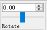
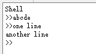

# C++项目管理及工程实践 分设计报告

> 康嘉成 3170101220

## 1. 分工任务及解决方案

### 1.1 分工任务

本人主要负责View模块的部分控件的实现，包含：
* 滑动条控件`Slider`
* 调色盘控件`ColorPicker`
* 复选框控件`CheckBox`
* 文件保存`SaveAsDialog`
* 绘制控件`DragTool`
* 命令行控件`TextEdit`
  
### 1.2 解决方案

本次工程中，View部分使用Qt开发，而Module部分应用v8引擎以及OpenCV库进行开发。本模块选择Qt作为开发工具，并提供v8接口。

## 2. 设计思路

### 2.1 整体说明

本模块主要工作在于模板化Qt的控件并进行封装，提供接口给v8引擎，可以通过脚本将对应的回调函数与控件相绑定。从而使得GUI的设计更容易解析，并保证用户自创脚本设计界面的可扩展性。

### 2.2 实现方法

本部分工作主要的一般实现方法为继承Qt控件类，根据脚本传输的参数设置控件的部分属性，并绑定回调函数，在控件触发某些信号时调用相应的回调函数来实现功能。
接下来以`DragTool`, `TextEdit`为例详细说明。

#### 2.2.1 绘制控件DragTool

`DragTool`类似于photoshop中的铅笔工具，该控件被选中时会监控鼠标事件，并且调用`onPress`/`onMove`/`onRelease`三个回调函数，以当前鼠标的x， y坐标为参数，实现绘图等功能。
其继承自Qt的按钮类`QToolButton`，构造函数声明如下：

```cpp
DragTool(const FunctionCallbackInfo<Value>& args);
```

其中`args`为v8解析js脚本命令后得到的参数，其中至少包含一个回调函数指针。此例中，`args`包含以下五个参数：

```cpp
std::string text
v8::Local<v8::Function> onpress
v8::Local<v8::Function> onmove
v8::Local<v8::Function> onrelease
std::string icon
```

注：`v8::Local`相当于`std::shared_ptr`
参数通过对应的宏提取出来之后，根据`text`以及`icon`内容设置控件的属性。

```cpp
GetImageView()->installEventFilter(this);
```

通过全局函数`GetImageView()`获取图像视图控件，并通过`QGraphicsView::installEventFilter()`注册对于视图控件的事件监控。当有鼠标事件传递至视图控件时，会调用`DragTool::eventFilter()`重载函数对事件进行处理，根据不同事件调用相应回调函数。
同时，由于存在多个`DragTool`控件，为避免冲突操作，使用静态变量`static DragTool* active_`记录当前激活的`DragTool`控件，在其他`DragTool`控件被激活时取消前者的激活状态。

#### 2.2.2 命令行控件TextEdit

`TextEdit`模拟matlab的命令行窗口，其继承自`QWidget`类，主体部分为文本框`QTextEdit`，在用户每次敲击回车时，将最新一条指令以`v8::String`指针形式传递给回调函数，由回调函数解析并实现相应功能。
每次新的指令需要被输入时，会在文本框末尾一行添加`>>`符号，最后一个`>>`之后的内容会被判定成为指令传输给回调函数。当光标移动到最后一个`>>`之前时，事件过滤器会屏蔽按键的字符输入，即`>>`之前的部分不可修改。

## 3. 运行效果图





**其余控件运行效果无法直接截图，请见可执行文件*

## 4. 心得体会&课程意见

通过为期三天的课堂教学，我知晓了当前多人团队协作开发时的版本控制与持续集成概念及其主流软件，理解了线程/进程的详细概念与用户界面的MVC, MVP, MVVM框架。在之后七天的课程实践当中，我对上述概念进行了进一步的实践与应用，基本掌握主流版本控制工具，并在实践中加深了对于MVVM框架的理解。除此之外，实践开发过程也增加了我对于Qt等程序工具的熟练程度。
对于本课程，我个人认为课程实践的选题范围过于庞大，由于我们的开发经验不足，很可能会出现前期将开发目标定得过高或过低，从而导致时间难以分配等一系列问题，同时不合适的选题也可能造成难以应用MVVM框架。建议今后的课程中，在保留开放选题的同时，提供若干个由经验丰富的老师拟定的复杂度适中，易于应用MVVM框架的推荐选题，从而更有助于同学们对于课程知识的深入理解。
