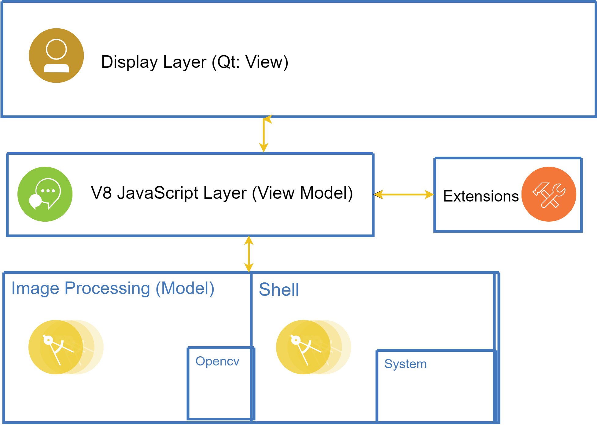
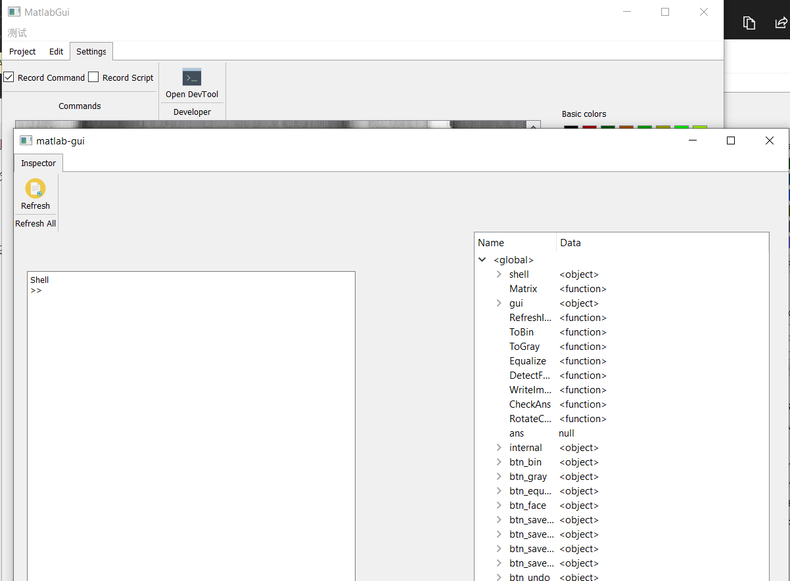

# Matlab + PS ViewModel 分报告

### 1.1 分工任务

本次分工负责整合代码，使用ViewModel将其他两位组员的内容整合起来。

由于整合代码中间难免会出错，所以需要和两位沟通并一起Debug。

大致任务如下：

1. 确定基础架构，预先写好Model层和View层的Demo

2. 确定小组每次功能目标，在两位组员完成进度不一致时介入辅助较慢的。
3. 完成Model层的Shell功能，向JS引擎(View Model)层暴露系统调用和文件读写功能。
4. 完成View层的布局管理
5. 在View层和组员合作完成 DevTools 功能。
6. 修正Model层一些各种操作导致崩溃
7. 修正View层提供的组件自身布局的问题
8. 将Model层的功能和View层绑定
9. 实现撤回、重做、脚本数据与批处理功能
10. 开发painter 功能


### 1.2 解决方案

主要通过Model层和View层向V8引擎暴露对应的api，然后在JS里进行绑定和操作记录的操作。

在ViewModel层使用JS的好处如下：

1. 更快地开发，特别是实现撤销、重做等功能
2. 方便写拓展
   1. 用户可以自行添加拓展
   2. 拓展功能是跨平台的，不需要为不同系统单独编译dll 或者 .so 文件
   3. 拓展文件可读性强，可以由用户基于此二次开发拓展
3. 原生支持命令行操作：我们提供了类似Matlab的命令行功能以及Object Inspector ，给高级用户提供了方便，因为可能在某些情况下命令行比图形界面快
4. JS可以很方便地记录下来，保存之后作为批处理文件，JS的批处理文件一度易改，跨平台，方便用户分发批处理功能


### 2. 1 设计思路

首先是整体架构如下：




而我主要负责中间Model和View沟通的一层。

#### 2.1.1 Redo, Undo

撤销功能是很重要的功能，能大大增强可用性。

实现的方法是在JS里定义一个 `internal` 的全局变量，这个变量存储着重做命令大致如下：

```javascript
internal = {
    command_stack: [
        redo: function,
        undo: function
    ]
}
```


每个组件在调用对应的操作之后会像internal 提交`redo, undo` 的函数以及所需数据。

当然是启用撤回功能可以在设置里设置


#### 2.1.2 Batch & Scripting

同样internal还包含了一个脚本栈：

```javascript
script_stack: [
        source: string
]
```

这样子每次操作都可以由脚本记录下来

记录下来之后提供导出脚本功能。那么批处理功能自然就实现了：再每一张给图片上运行脚本。


#### 2.1.3 Dev Tools

开发者工具顾名思义是提供给开发者的，主要是给一些高阶用户创建更加复杂的，高级的功能和测试，这样能让开发者动态得到反馈。

Dev Tools 分为两部分，一部分是console，就是命令行界面，用户可以直接往程序里面注入命令，这包括了图像处理命令和gui命令，所以它相当于与Malab界面。

除此之外我们还提供了一个inspector界面，方便用户检查当前所有的变量。


### 3. 运行效果


上图是我们的主界面，包括了保存、批处理打开文件等功能，同样我们支持了painter，即在图片上涂鸦的功能。


上图是我们的编辑能力，包含了撤销和重做，transform以及一些滤波的能力。

上图首先灰阶再直方图均匀化最后锐化得到的结果





上图是我们的DevTools，可以观察所有变量以及再Shell里输入对应的命令。


